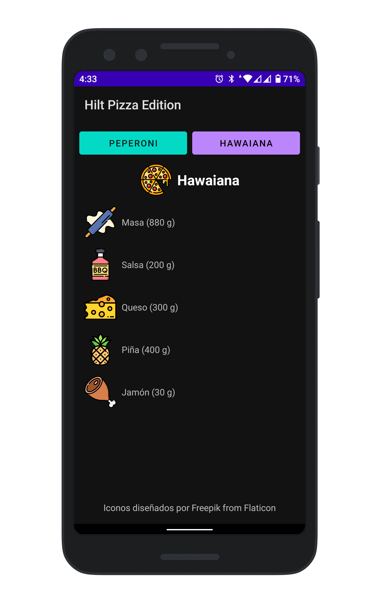

# dagger-hilt-starter
Example about how to setup and implement Dagger Hilt in order to understand the basic concepts



## Setup
1. ### build.gradle
    You can check up the last plugin version on [Maven](https://mvnrepository.com/artifact/com.google.dagger/hilt-android)
    ```kotlin
    buildscript {
        ...
        ext.hilt_version = "2.31.2-alpha"
        ...
        repositories {
            // other repositories...
            mavenCentral()
        }
        dependencies {
            // other plugins...
            classpath "com.google.dagger:hilt-android-gradle-plugin:$hilt_version"
        }
    }
    ```

1. ### app/build.gradle
    ```kotlin
    plugins {
        ...
        id "org.jetbrains.kotlin.kapt"
        id "dagger.hilt.android.plugin"
    }

    ...

    dependencies {
        ...
        implementation "com.google.dagger:hilt-android:$hilt_version"
        kapt "com.google.dagger:hilt-android-compiler:$hilt_version"

        // For instrumentation tests
        androidTestImplementation  "com.google.dagger:hilt-android-testing:$hilt_version"
        kaptAndroidTest "com.google.dagger:hilt-android-compiler:$hilt_version"

        // For local unit tests
        testImplementation "com.google.dagger:hilt-android-testing:$hilt_version"
        kaptTest "com.google.dagger:hilt-android-compiler:$hilt_version"

        // Activity KTX for viewModels()
        implementation "androidx.activity:activity-ktx:1.2.0"
        ...
    }

    kapt {
        correctErrorTypes true
    }
    ```

## Implementation

1. ### Application class
    ```kotlin
    @HiltAndroidApp
    class MyApplication : Application()
    ```

    ```xml
    <application
        ...
        android:name=".MyApplication">
    ```

1. Create Module and define providers
    ```kotlin
    @Module
    @InstallIn(ActivityComponent::class, ViewModelComponent::class)
    object PizzaModule {
        ...
    }
    ```

1. Refactor ViewModel to be able of receive injected dependencies
    ```kotlin
    @HiltViewModel
    class MainViewModel @Inject constructor(
        @Named("Hawaiana") private val pizzaHawaiana: Pizza,
        @Named("Peperoni") private val pizzaPeperoni: Pizza
    ) : ViewModel() {
    ```

1. Refactor MainActivity to be able of receive injected dependencies
    ```kotlin
    @AndroidEntryPoint
    class MainActivity : AppCompatActivity() {

        private lateinit var binding: ActivityMainBinding
        private val mainViewModel: MainViewModel by viewModels()
        ...
    }
    ```